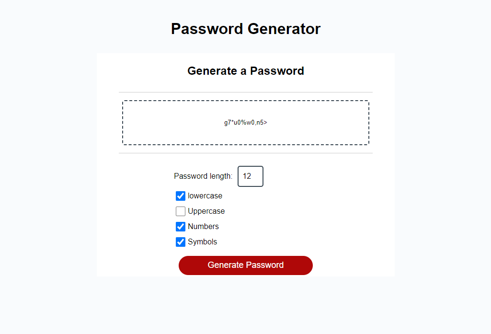

# Password Generator
This application allows employees with access to sensitive data to generate a random password that meets certain criteria. The app runs in the browser and features dynamically updated HTML and CSS powered by JavaScript code.

## User Story
As an employee with access to sensitive data, I want to randomly generate a password that meets certain criteria so that I can create a strong password that provides greater security.

## Technologies Used
- HTML
- CSS
- JavaScript

## How to Use
1. Open the index.html file in your web browser.
2. Click the "Generate Password" button.
3. Follow the prompts to select your password criteria.
4. Once all prompts are answered, your secure password will be generated and displayed.

## Assets

### Link to GitHub Repository:

[https://github.com/ademonteverde/password-generator](https://github.com/ademonteverde/password-generator)

### Link to deployed application:

[https://ademonteverde.github.io/password-generator/](https://ademonteverde.github.io/password-generator/)
## License

This project is licensed under the [MIT](https://github.com/ademonteverde/password-generator/blob/main/LICENSE) License.